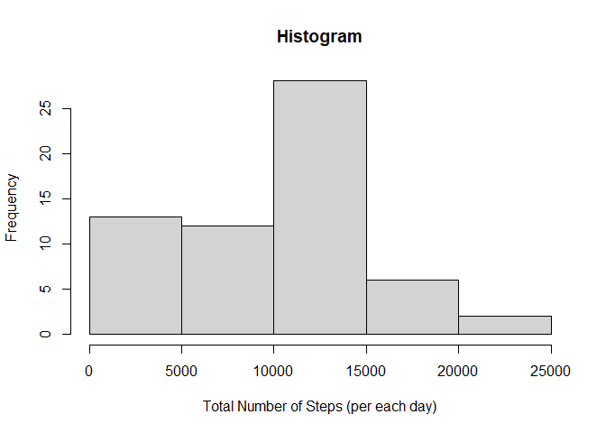
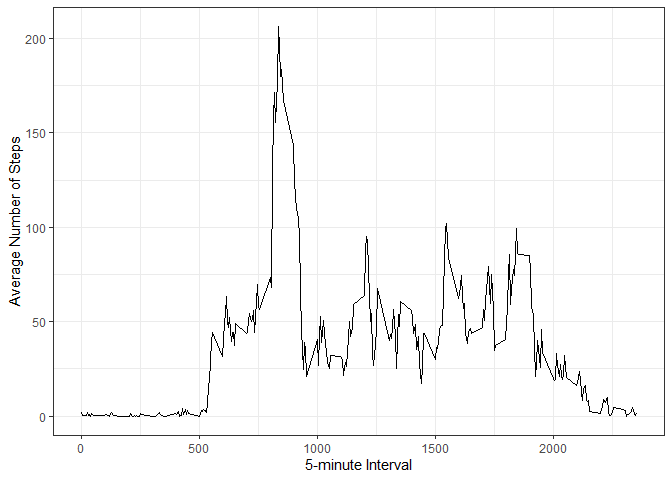
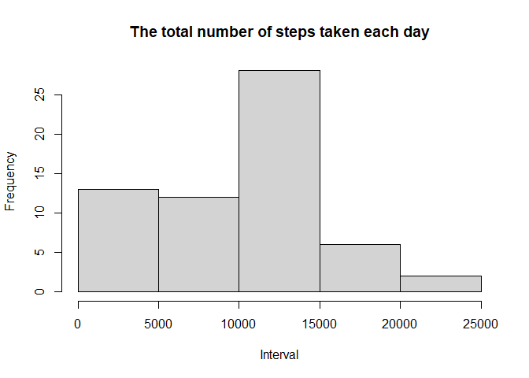
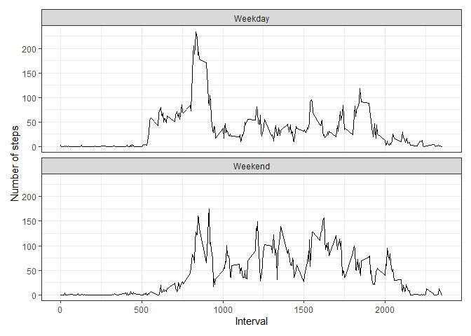

## Loading and preprocessing the data

```r
## Install Packages
packages <- c("dplyr", "tidyr", "ggplot2", "knitr")
installed.packages <- packages %in% rownames(installed.packages())
if(any(installed.packages == FALSE)){
        install.packages(packages[!installed.packages])
}
invisible(lapply(packages, library, character.only = TRUE))

## Load data
## NOTE: The activity.zip file should be unzipped into "Data" folder using the following function: unzip("activity.zip", exdir = "Data")
data <- read.csv("./Data/activity.csv")

## Change the format of "date" variable
data$date <- as.Date(data$date, format = "%Y-%m-%d")
```

## What is mean total number of steps taken per day?

```r
## 1. Calculate The total number of steps taken per day
data %>% group_by(date) %>% 
        summarize("Total Number of Steps" = sum(steps, na.rm = T)) %>%
        kable
```


|date       | Total Number of Steps|
|:----------|---------------------:|
|2012-10-01 |                     0|
|2012-10-02 |                   126|
|2012-10-03 |                 11352|
|2012-10-04 |                 12116|
|2012-10-05 |                 13294|
|2012-10-06 |                 15420|
|2012-10-07 |                 11015|
|2012-10-08 |                     0|
|2012-10-09 |                 12811|
|2012-10-10 |                  9900|
|2012-10-11 |                 10304|
|2012-10-12 |                 17382|
|2012-10-13 |                 12426|
|2012-10-14 |                 15098|
|2012-10-15 |                 10139|
|2012-10-16 |                 15084|
|2012-10-17 |                 13452|
|2012-10-18 |                 10056|
|2012-10-19 |                 11829|
|2012-10-20 |                 10395|
|2012-10-21 |                  8821|
|2012-10-22 |                 13460|
|2012-10-23 |                  8918|
|2012-10-24 |                  8355|
|2012-10-25 |                  2492|
|2012-10-26 |                  6778|
|2012-10-27 |                 10119|
|2012-10-28 |                 11458|
|2012-10-29 |                  5018|
|2012-10-30 |                  9819|
|2012-10-31 |                 15414|
|2012-11-01 |                     0|
|2012-11-02 |                 10600|
|2012-11-03 |                 10571|
|2012-11-04 |                     0|
|2012-11-05 |                 10439|
|2012-11-06 |                  8334|
|2012-11-07 |                 12883|
|2012-11-08 |                  3219|
|2012-11-09 |                     0|
|2012-11-10 |                     0|
|2012-11-11 |                 12608|
|2012-11-12 |                 10765|
|2012-11-13 |                  7336|
|2012-11-14 |                     0|
|2012-11-15 |                    41|
|2012-11-16 |                  5441|
|2012-11-17 |                 14339|
|2012-11-18 |                 15110|
|2012-11-19 |                  8841|
|2012-11-20 |                  4472|
|2012-11-21 |                 12787|
|2012-11-22 |                 20427|
|2012-11-23 |                 21194|
|2012-11-24 |                 14478|
|2012-11-25 |                 11834|
|2012-11-26 |                 11162|
|2012-11-27 |                 13646|
|2012-11-28 |                 10183|
|2012-11-29 |                  7047|
|2012-11-30 |                     0|

```r
## 2. Make a histogram of the total number of steps taken per each day
data %>% group_by(date) %>% 
        summarize(sum = sum(steps, na.rm = T)) %>%
        pull(sum) %>% 
        hist(main = "Histogram",
             xlab = "Total Number of Steps (per each day)")
```

<!-- -->

```r
## 3. Calculate and report the mean and median of the total number of steps taken per day
data %>% group_by(date) %>% 
        summarize(sum = sum(steps, na.rm = T)) %>%
        pull(sum) %>% 
        c(Mean = mean(.), Median = median(.)) %>%
        .[c("Mean", "Median")]
```

```
##     Mean   Median 
##  9354.23 10395.00
```

## What is the average daily activity pattern?

```r
## 1. Make a time series plot of the 5-minute interval (x-axis) and the average number of steps taken, averaged across all days (y-axis)
data_interval <- data %>% 
        group_by(interval) %>%
        summarize(mean = mean(steps, na.rm = T))

data_interval %>% ggplot(aes(interval, mean)) + 
                geom_line() + 
                theme_bw() + 
                labs(x = "5-minute Interval", 
                     y = "Average Number of Steps")
```

<!-- -->

```r
## 2. Which 5-minute interval contains the maximum number of steps?
with(data_interval, which(mean == max(mean))) %>% data_interval[., "interval"]
```

```
## # A tibble: 1 x 1
##   interval
##      <int>
## 1      835
```


## Imputing missing values
There are a number of days/intervals where there are missing values.

```r
## 1. Calculate and report the total number of missing values in the dataset
is.na(data[,1]) %>% sum
```

```
## [1] 2304
```

```r
## 2. Devise a strategy for filling in all of the missing values in the dataset. 

## Firstly, I found that, on every date which contains missing data, the entire data set is NAs; there is not a single measurement on these days. This indicates that imputing data based on the mean/median for these days is not possible. Therefore, I choose to impute the data based on the mean/median for each 5-minute interval.

## And then, I found by exploratory analysis that the number of steps taken on each day at given 5-minute interval has large variability. For example, at 0-minute interval, the minimum number of steps taken was 0, the maximum was 47 and the median was 0. This clearly shows that the data is skewed and indicates using median, rather than mean, is more appropriate for imputing the missing data.

Imputing <- data %>% 
        group_by(interval) %>% 
        summarize(Median = median(steps, na.rm = T))


## 3. Create a new dataset that is equal to the original dataset but with the missing data filled in.

Valid_data <- data[!is.na(data[ ,1]), ]
NA_data <- data[is.na(data[ ,1]), ] 

NA_data <- merge(NA_data, Imputing, by = "interval")
NA_data$steps <- NA_data$Median
NA_data <- select(NA_data, -Median)

Imputed_data <- rbind(Valid_data, NA_data)

## 4-1. Make a histogram of the total number of steps taken each day and Calculate and report the mean and median total number of steps taken per day.
Imputed_statistics <- Imputed_data %>% 
                group_by(date) %>%
                summarize(Sum = sum(steps))

pull(Imputed_statistics, Sum) %>% 
        hist(main = "The total number of steps taken each day",
             xlab = "Interval")
```

<!-- -->

```r
Imputed_statistics %>% pull(Sum) %>% 
        c(Mean = mean(.), Median = median(.)) %>%
        .[c("Mean", "Median")]
```

```
##      Mean    Median 
##  9503.869 10395.000
```

```r
## 4-2. Do these values differ from the estimates from the first part of the assignment? What is the impact of imputing missing data on the estimates of the total daily number of steps?
Original_statistics <- data %>%
                group_by(date) %>%
                summarize(Sum = sum(steps))

Original_statistics %>% pull(Sum) %>% 
        c(Mean = mean(., na.rm = T), Median = median(., na.rm = T)) %>%
        .[c("Mean", "Median")]
```

```
##     Mean   Median 
## 10766.19 10765.00
```

```r
## Mean and median are different. Both values are lower in the imputed dataset.
```


## Are there differences in activity patterns between weekdays and weekends?

```r
## 1. Create a new factor variable in the dataset with two levels – “weekday” and “weekend” indicating whether a given date is a weekday or weekend day.

invisible(Sys.setlocale("LC_TIME", "English"))
data_weekday <- mutate(data, type = weekdays(data$date))
f <- data_weekday[,4] == "Saturday" | data_weekday[,4] == "Sunday"
data_weekday$type[f] <- "Weekend"
data_weekday$type[!f] <- "Weekday"
data_weekday$type <- as.factor(data_weekday$type)

## Make a panel plot containing a time series plot of the 5-minute interval (x-axis) and the average number of steps taken, averaged across all weekday days or weekend days (y-axis). 

data_weekday %>% group_by(interval, type) %>%
                summarize(mean = mean(steps, na.rm = T)) %>%
                ggplot(aes(interval, mean)) +
                geom_line() + 
                facet_wrap(~ type, nrow = 2) +
                theme_bw() +
                labs(x = "Interval",
                     y = "Number of steps") +
                theme(plot.margin = margin(10, 10, 10, 10, "pt"))
```

<!-- -->
